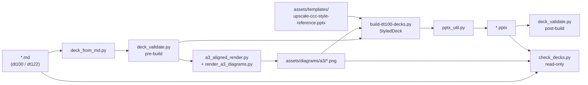

# PPTX generation pipeline — architecture

**Scope:** DT100 A3 (`dt100/`) and DT122 B6 (`dt122/`) decks.  
**Run:** `uv run build-decks` · **Litmus:** `uv run check-decks` · **Tests:** `uv run pytest tests/ -q`

---

## Where Python lives

| Location | Role | Examples |
|----------|------|----------|
| **`scripts/`** | **Deck pipeline** — all PPTX generation, parsing, validation, diagram render | `build-dt100-decks.py`, `deck_from_md.py`, `pptx_util.py`, `a3_aligned_render.py`, `check_decks.py` |
| **`src/gluon_cli/`** | **uv entry points** — thin `[project.scripts]` wrappers; delegate to `scripts/` | `build_decks`, `check_decks` |
| **`src/py/`** | **Samples only** — pytest / uv wiring smoke (not used by decks) | `hello.py`, `fib.py` |
| **`tests/`** | **Regression** — unit tests + `uv run` subprocess smoke; DT125 canary deck later | `test_hello.py`, `test_uv_commands.py` |

**Rule of thumb:** edit deck behavior under `scripts/`. Invoke via `uv run …`, not shell wrappers.

Bootstrap shell only: `bootstrap-gluon-zombie.sh`, `zombie-pull-build.sh`.

---

## Source → artifact map

```
dt100/bugatti-qos-architecture.md  ──┐
assets/templates/upscale-ccc-style-reference.pptx
assets/diagrams/a3/*.png  (generated) ├──► dt100/bugatti-qos-architecture.pptx
                                      │
dt122/bugatti-qos-ccc.md  ────────────┼──► dt122/bugatti-qos-ccc.pptx
assets/logical-pipeline-boss-slide.png ┘
```

**Authoritative input:** markdown in `dt100/` and `dt122/`. Do not hand-edit `.pptx` for content — regen after md changes.

---

## Pipeline stages



### 1. Parse (`deck_from_md.py`)

Reads deck markdown into `DeckDocument` / `DeckSlide` dataclasses — cover fields, slide titles, bullets, notes, diagram stems (A3), image refs (B6).

### 2. Pre-build validation (`deck_validate.py`)

Fail-loud checks before any write: style template present, md structure complete, required assets exist, diagram stems declared.

### 3. Diagram render — A3 only

| Module | Responsibility |
|--------|----------------|
| `render_a3_diagrams.py` | Batch driver: which stems to render from md |
| `a3_aligned_render.py` | Layout + labels from md → PNG via **PyMuPDF** (no Mermaid/Chrome) |

Output: `assets/diagrams/a3/{stem}.png`. B6 today uses committed raster assets (e.g. pipeline boss slide), not inline diagram generation.

### 4. Build (`build-dt100-decks.py`)

- Copies company template → output path.
- `StyledDeck` trims template to cover + N content slides.
- Fills cover/content via `pptx_util.py` (Upscale palette, font bands, diagram placement).
- Saves and runs zip-level pptx sanity check.

### 5. Post-build validation (`deck_validate.py`)

Slide count, file size, opens cleanly — same checks whether run inside build or standalone litmus.

### 6. Litmus (`check_decks.py`)

Read-only: validates md + PNGs + committed `.pptx` without regenerating. Used by zombie hatch and CI-style smoke.

---

## Module dependency sketch

```
build-dt100-decks.py
├── deck_from_md.py
├── deck_validate.py
├── pptx_util.py
└── render_a3_diagrams.py
    └── a3_aligned_render.py
        └── deck_from_md.py

check_decks.py
├── deck_from_md.py
└── deck_validate.py
```

`scripts/` modules import each other via `sys.path` insert (not installed packages). Only `gluon_cli` is packaged for `uv run` entry points.

---

## Commands

```bash
uv sync                          # runtime deps (python-pptx, Pillow, pymupdf)
uv sync --group dev              # + pytest

uv run build-decks               # A3 + B6 regen
uv run build-decks-a3            # A3 only
uv run check-decks               # litmus (no writes)

uv run pytest tests/ -q          # samples + uv subprocess regression
```

Optional render extras: `uv sync --extra render` (cairosvg — not on A3 hot path today).

---

## Validation layers (what each proves)

| Layer | Tool | Proves |
|-------|------|--------|
| **Build litmus** | `uv run check-decks` | md valid · PNGs exist · pptx opens · slide count |
| **Pytest smoke** | `test_uv_commands.py` | entry points runnable end-to-end |
| **Zombie regen** | `zombie-pull-build.sh` | cross-host toolchain + regen |
| **Acceptance** | *DT124 — not built* | md ↔ on-slide copy, delivery gates — see [DECK-ACCEPTANCE.md](DECK-ACCEPTANCE.md) |
| **Canary** | *DT125 — not built* | fast falsifiable md→pptx regression fixture |

**Build success ≠ stakeholder-deliverable.** DT124 acceptance is a separate gate before Guru/W delivery.

---

## Cross-host notes

- Regenerating `.pptx` on Linux vs macOS can change zip bytes (expected). Zombie restores committed pptx after litmus: `git restore dt100/*.pptx dt122/*.pptx`.
- Style template is committed at `assets/templates/upscale-ccc-style-reference.pptx` (fallback seed: `~/Downloads/Mirror-Sflow-Bugatti-ASIC-CCC.pptx`).

---

## Phased plan (baby steps)

**Now — ship ccc (DT122 P0):** production pipeline stays in **`scripts/`** (legacy bespoke location). No move during delivery.

**Parallel — gain trust (DT125):** toy with pytest on a **canary** only — copy slice of pipeline logic into `src/py/` (or sibling package), fixture md + mermaid → png → pptx, falsifiable markers. Does not touch `dt100/` / `dt122/` sources yet.

**Later — migrate (after ccc + green canary):** move QoS (A3) and ccc (B6) slides onto the tested code path; retire or thin `scripts/` to bootstrap/docs only.

| Phase | Location | Scope |
|-------|----------|--------|
| **1 — deliver** | `scripts/` | B6 Mermaid 2A · regen `dt122/bugatti-qos-ccc.pptx` |
| **2 — canary** | `src/py/` copy + `tests/fixtures/` | Mini deck regression; build trust |
| **3 — migrate** | `src/py/` (proper package) | A3 + B6 on new workflow |

`src/py/hello` + `fib` remain the generic uv/pytest seed; canary pipeline is separate code copied in, not a big-bang move of `scripts/` mid-delivery.
